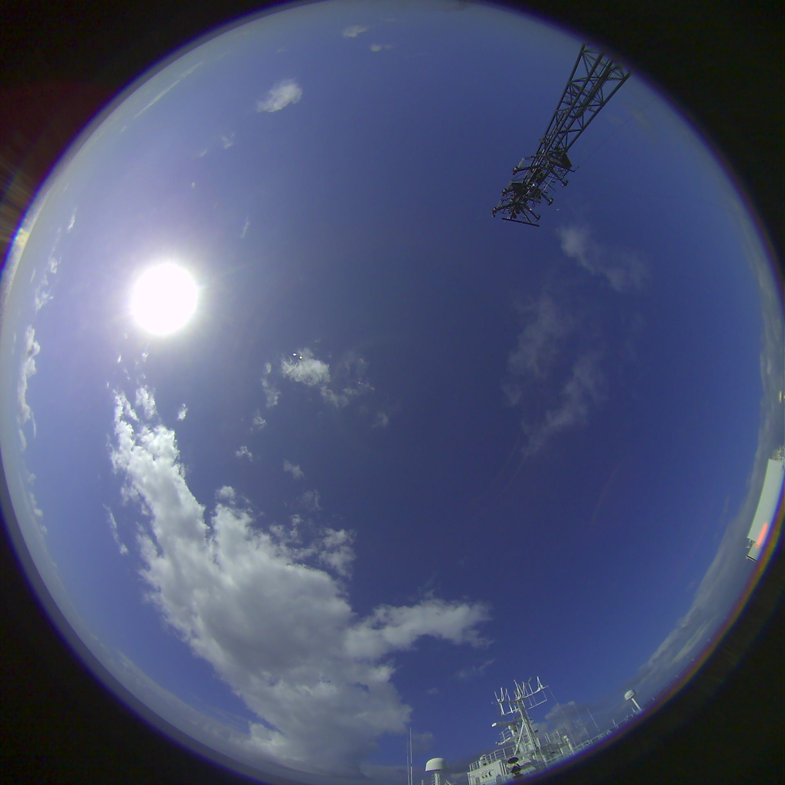
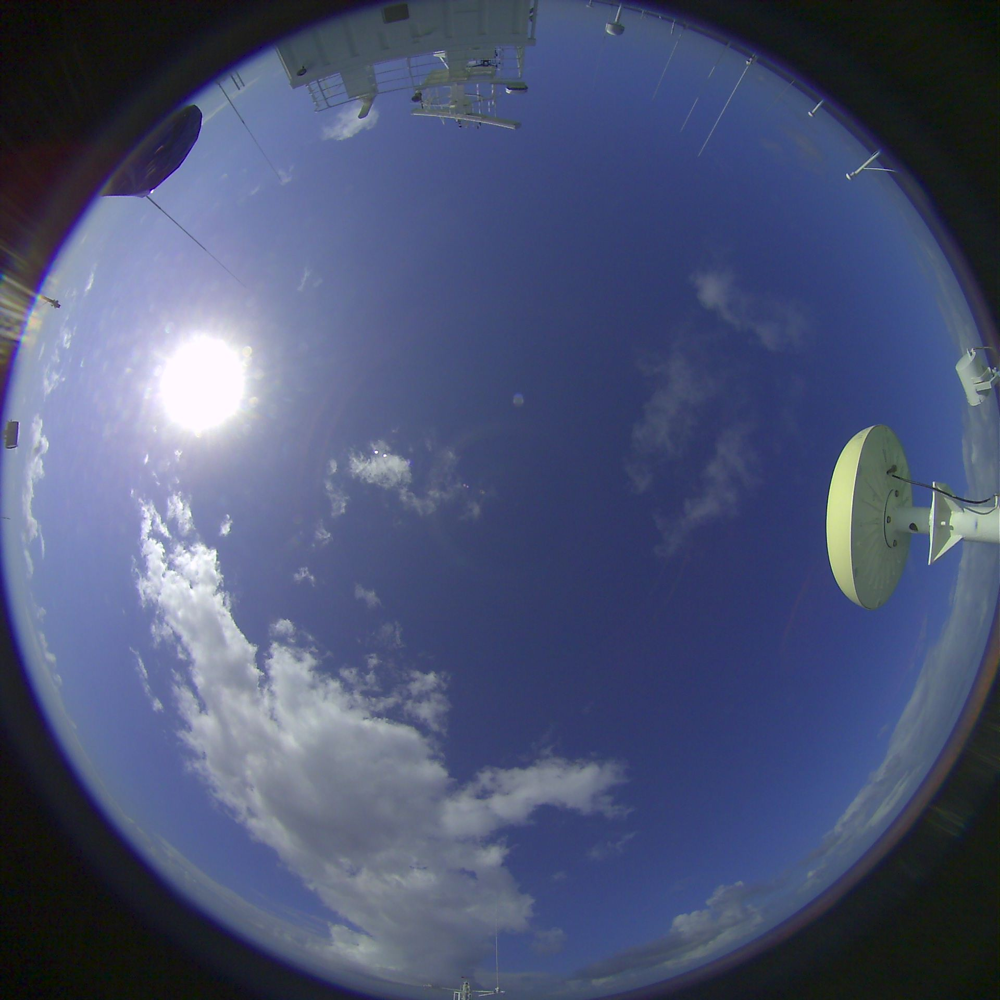

Домашнее задание к лекции 2019-10-01 по теме "Классификация задач и методов машинного обучения". вес = 0.4, максимальный балл = 100.

Для двух из нижеперечисленных геофизических проблем следует поставить задачу в терминах машинного обучения (МО).

1. определить тип задачи МО ("С учителем" / "Без учителя" / другое (уточнить) )
2. определить вид задачи МО (регрессия, кластеризация, понижение размерности, классификация...)
3. описать целевую переменную, указать ее тип и размерность
4. описать общий смысл функции потерь, если это подразумевается типом задачи. Если есть возможность - выписать явный вид функции потерь
5. описать объекты (события)
6. предложить признаковое описание объектов или описать уже имеющееся признаковое описание. Указывать тип и размерность признакового описания.
7. (опционально) предложить возможные варианты дополнения признакового описания  или понижения его размерности, потенциально позволяющие упростить решение
8. исходя из понимания задачи, предложить метрику (метрики) для оценки качества модели МО.

Проблемы №№1-3. Облачность и радиация.

Приходящая солнечная радиация - единственный (условно) стабильный и (условно) восполняемый источник энергии на планете Земля. Кроме того, солнечная радиация - практически единственный источник энергии, питающий всю динамику атмосферы и океана. Радиационный блок в моделях атмосферы - важнейшая часть. Для оценки приходящей солнечной радиации в моделировании геофизических систем в настоящий момент чаще всего применяются т.н.. параметризации - упрощенные схемы, аппроксимирующие процессы рассеяния, поглощения, переотражения, переизлучения солнечной радиации в атмосфере. Важнейшей переменной во всех параметризациях приходящей солнечной радиации является общий балл облачности.

Для построения аккуратной параметризации потоков приходящей на поверхность коротковолновой и длинноволновой радиации нужны долговременные ряды соответствующих показаний радиометрических приборов и оценки балла общей облачности.

В Лаборатории взаимодействия океана и атмосферы и мониторинга климатических изменений ведется работа по автоматизации наблюдений за облачностью. Для этого была разработана и апробирована установка, проводящая оптическую съемку облачности с поверхности. Результатом съемки являются снимки следующего рода:

<table>
    <tr>
        <td width="50%">
            
        </td>
        <td width="50%">
            
        </td>
    </tr>
</table>

Рис. 1. Снимки видимой полусферы небосвода над океаном, сделанные двумя разнесенными на расстояние L камерами.

Одновременно со съемкой ведутся визуальные наблюдения. В результате таких наблюдений фиксируются:

- балл общей облачности, оцененный наблюдателем

- баллы облачности по трем ярусам (нижний, средний, верхний), оцененные наблюдателем

- наблюдаемые типы облачности

- наблюдаемое состояние диска солнца (4 класса от "пасмурно" до "Солнце в квадрате")

Одновременно со съемкой также непрерывно в автоматическом режиме производится запись показаний радиометрического оборудования: потоки приходящей коротковолновой и длинноволновой радиации.

Проблема №1: нужно оценивать поток приходящей солнечной радиации по данным наблюдений за облачностью

Проблема №2: оценивать высоту нижней границы облачности

Проблема №3: оценивать балл общей облачности

---

Проблема №4. Состав осадочных пород.

Палеореконструкция - способ оценки геофизических параметров по косвенным признакам, таким как химический состав раковин фораминифер, концентрация различных газов в осадочных породах на дне океана и пр. Распределение видов и размеров фораминифер, размеров и форм кристаллов различных минералов в осадочных породах - важнейшие характеристики, по которым можно восстановить направление и скорость течений, температуру и соленость воды и другие важнейшие геофизические характеристики. Пробы (керны) осадочных пород берутся в каждой геологической экспедиции ИОРАН. Каждый срез керна (соответствующий определенному времени в прошлом) предоставляет уникальную информацию об условиях формирования осадка в момент его накопления. Высушенные и разобранные по зернам образцы выглядят как песок, однако содержат ценную информацию в виде распределения видов и размеров зерен.

В Лаборатории палеоокеанологии ведется работа по микрофотографии некоторых из этих образцов для автоматизации оценки распределений по размерам, видам фораминифер и типам зерен. Каждый участок образца фотографируется шесть раз с различным фокусным расстоянием. В результате в распоряжении исследователя имеются серии снимков следующего рода:

<table>
    <tr>
        <td width="16%">
            
        </td>
        <td width="16%">
            
        </td>
        <td width="16%">
            
        </td>
    </tr>
    <tr>
        <td width="16%">
            
        </td>
        <td width="16%">
            
        </td>
        <td width="16%">
            
        </td>
    </tr>
</table>

<table>
    <tr>
        <td width="16%">
            
        </td>
        <td width="16%">
            
        </td>
        <td width="16%">
            
        </td>
    </tr>
    <tr>
        <td width="16%">
            
        </td>
        <td width="16%">
            
        </td>
        <td width="16%">
            
        </td>
    </tr>
</table>

Рис. 2. Серии (по 6 шт. с различным фокусным расстоянием) снимков препарата осадочных пород.

Задача состоит в том, чтобы оценить долю каждого из видов фораминифер (вернее, раковинок, которые от них остались) по количеству в образце, для чего нужно определить вид каждой раковины. Кроме этого, следует оценить долю минеральных зерен различного вида.

---

Проблема №5. Идентификация атмосферных явлений.

Интенсивные атмосферные явления (здесь будут рассматриваться тропические циклоны и мезомасштабные циклоны) часто ассоциированы с сильным приповерхностным ветром, что влечет угрозу судоходству, морским и береговым инфраструктурным объектам, жилищам. Тропические циклоны известны массовому читателю благодаря разрушительному воздействию некоторых из них на юго-восточных территориях США. Мезомасштабные циклоны не настолько известны, однако за счет сильного ветра на поверхности океана и, как следствие, интенсивных потоков скрытого тепла, они могут инициировать глубокую конвекцию в океане.

Изучение экстремальных атмосферных явлений опирается на составленные климатологии - базы данных идентифицированных событий и их траекторий. Мезоциклоны удобнее всего идентифицировать в спутниковых снимках, поскольку они оставляют четкий отпечаток в поле облачности, которая ярко выделяется на инфракрасных спутниковых снимках, особенно над относительно теплой поверхностью океана. Спутниковые снимки в инфракрасном диапазоне выглядят следующим образом:

<table>
    <tr>
        <td width="50%">
            
        </td>
        <td width="50%">
            
        </td>
    </tr>
</table>

Рис. 3. Инфракрасные спутниковые мозаики антарктического региона.

На рис. 3. справа отмечены положения и размеры идентифицированных экспертом мезоциклонов. Однако следует учитывать, что такая разметка занимает много времени. Для построения глобальной климатологии мезоциклонов использовать труд эксперта экономически нецелесообразно. Цель работы по идентификации интенсивных атмосферных явлений - в конструировании модели, способной идентифицировать их автоматически.